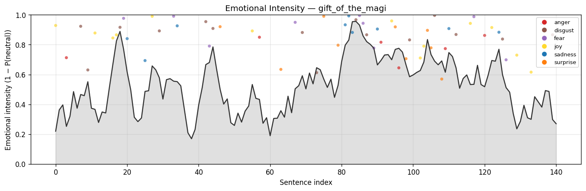
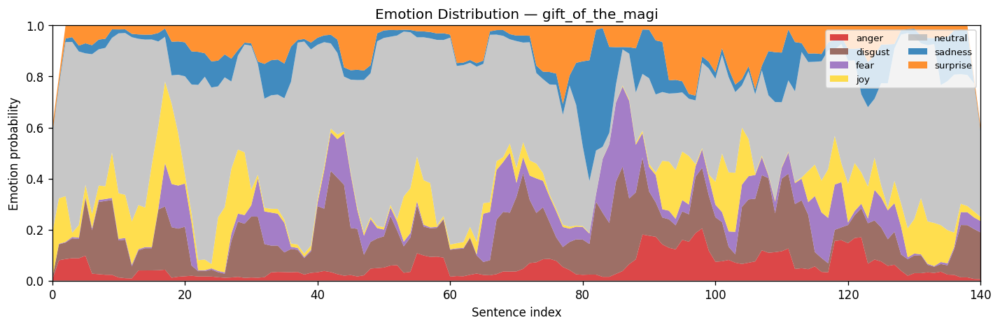

<div align="center">

# 🎙️ Emotional Audiobook

### *Turn any storybook into an audiobook that **feels** the story - voice tone tracks the emotional arc, line by line.*

<p>
  
  
  
  
  
  
</p>


</div>

---

## 💡 The Idea in 30 Seconds

Most text-to-speech audiobooks sound **flat**. A heartbreaking line and a weather report are read in the exact same voice. This project fixes that.

It reads a story, **figures out what each sentence feels like** (joy, fear, sadness, surprise…), and uses that emotional map to drive a smarter narration - calm voice for narration, an expressive voice for the dramatic moments - automatically.

> **In one command:** raw `.txt` → emotion-aware MP3 audiobook + synced subtitles + a visual "emotion arc" of the whole story used as the cover art.

---

## 🎬 See It In Action

The pipeline reads O. Henry's *The Gift of the Magi* and produces this **emotional intensity arc** - every peak is a dramatic moment the system will narrate with extra expression:

<div align="center">
  
  <br/>
  <em>↑ Each peak = a dramatic moment. The dots show which emotion is dominant at that point.</em>
</div>

<br/>

And here is the **full emotion distribution** across the story - anger, fear, joy, sadness and more, sentence by sentence:

<div align="center">
  
  <br/>
  <em>↑ A stacked view of all seven emotions. You can literally see the story's mood shift.</em>
</div>

---

## 🌟 Why This Matters

Imagine you're listening to your favourite novel on a long drive. With most TTS audiobooks today, the narrator's voice is robotic and unchanging - even the scariest, saddest or happiest passages all sound the same. It's like watching a movie where the soundtrack never changes.

**This project teaches a computer to read with feeling.** It does three things a human narrator does naturally:

1. 📖 **Reads the story carefully** and decides which parts are emotional and which are just connecting plot.
2. ❤️ **Holds onto the emotional moments** word-for-word, while gently condensing the in-between parts (so you don't lose the punch).
3. 🎤 **Switches narration style** - calm and clear for the normal parts, expressive and dramatic for the emotional peaks.

The result is an MP3 you can play in any music app, complete with synced subtitles and a custom cover image that visualises the story's emotional journey.

---

## 🧠 Why This Matters (Technical Version)

This is a **production-style ML pipeline** that combines four research areas into one cohesive system:

| Discipline | Component | What it solves |
|---|---|---|
| **NLP – Classification** | DistilRoBERTa emotion model (7-class) | Tagging every sentence with an emotion + confidence distribution |
| **NLP – Summarization** | DistilBART (CNN/DailyMail) + custom *anchor-and-compress* strategy | Standard summarizers strip emotional nuance because it's not "informative" - we preserve emotional peaks verbatim and only compress the connective tissue between them |
| **Generative Speech – Consistency** | Coqui **XTTS-v2** | A fast, consistent narrator voice for ~80% of the text |
| **Generative Speech – Expression** | Suno **Bark** with emotion-conditioned cues (`[sighs]`, `[gasps]`, `[laughs softly]`) | Re-synthesises the top 20% most emotional sentences with a dramatically more expressive model |
| **Audio Engineering** | `pydub` + `ffmpeg` + custom dBFS trailing-silence trim + `mutagen` ID3 tagging | Stitches clips, fixes Bark's known trailing-noise artefact, exports MP3 with embedded cover art |

The result: **one CLI command** turns a `.txt` file into a fully produced audiobook with synced SRT subtitles.

---

## ⚙️ Architecture

```
            ┌─────────────────────────────────────────────────────┐
            │  Phase 1 · Ingestion                                │
 story.txt ─▶  Strip Gutenberg boilerplate · NLTK sentence split ─▶ segmented.json
            │  Optional: extract named section from anthologies   │
            └─────────────────────────────────────────────────────┘
                              │
                              ▼
            ┌─────────────────────────────────────────────────────┐
            │  Phase 2 · Emotion Analysis                         │
            │  DistilRoBERTa-7 · per-sentence top label + full    │
analyzed.json◀  distribution · plots intensity arc & emotion     ─▶ intensity.png, arc.png
            │  distribution as PNGs                               │
            └─────────────────────────────────────────────────────┘
                              │
                              ▼
            ┌─────────────────────────────────────────────────────┐
            │  Phase 3 · Emotion-Aware Summarisation              │
 summary.json◀  "Anchor & Compress":                              │
            │   · Pick anchors (top 20% by 1 − P(neutral))        │
            │   · Compress bridges between anchors with DistilBART│
            │   · Stitch: anchors verbatim + summarised bridges   │
            └─────────────────────────────────────────────────────┘
                              │
                              ▼
            ┌─────────────────────────────────────────────────────┐
            │  Phase 4 · Dual-Engine TTS  (GPU)                   │
   wavs/  ◀──  Bridges  → XTTS-v2  (fast, consistent narrator)   ─▶ NNNN_slug.wav
            │  Anchors  → Bark     (expressive, cued by emotion)  │
            │  Automatic fallback to XTTS if Bark fails           │
            └─────────────────────────────────────────────────────┘
                              │
                              ▼
            ┌─────────────────────────────────────────────────────┐
            │  Phase 5 · Audio Assembly + Polish                  │
   story.mp3◀  Trailing-silence trim (Bark noise) · stitch with  ─▶ story.srt
            │  350ms / 600ms gaps · MP3 export · embed intensity  │
            │  arc as ID3 APIC cover art · generate synced SRT    │
            └─────────────────────────────────────────────────────┘
```

---

## 🎯 Key Engineering Highlights

These are the bits I'm most proud of and would be happy to walk through in an interview:

<details>
<summary><strong>🎯 The "Anchor &amp; Compress" Summariser</strong> - solving a real flaw in off-the-shelf summarisers</summary>

<br/>

Standard summarisers (BART, T5) optimise for **information density** - they strip emotional content because it isn't factually "informative". For a story, the emotional turning points *are* the point.

My fix:
1. From the Phase 2 emotion scores, identify **anchor sentences** - the top 20% by emotional intensity (`1 − P(neutral)`).
2. Between anchors, run normal abstractive summarisation to compress the connective tissue.
3. Stitch anchors back in **verbatim** so every emotional beat survives.

The summary keeps every emotional turn while dropping filler. See [`src/summarizer.py`](src/summarizer.py).

</details>

<details>
<summary><strong>🎙️ Dual-Engine TTS Routing</strong> - mimicking how human narrators actually work</summary>

<br/>

Human audiobook narrators read most text in a neutral register and only "perform" at dramatic moments. The pipeline does the same:

- **XTTS-v2** synthesises every segment - fast (~1–3s/segment on a T4 GPU), consistent voice.
- **Bark** *re-synthesises only the anchor segments* with a bracketed emotion cue derived from the segment's label (`[gasps]` for fear, `[laughs softly]` for joy, etc.).
- If Bark fails or times out, the original XTTS render is kept - graceful degradation, no broken audiobooks.

See [`src/tts_engine.py`](src/tts_engine.py).

</details>

<details>
<summary><strong>🔇 Trailing-Silence Trim</strong> - fixing a known Bark artefact in audio</summary>

<br/>

Bark frequently appends 1–3 seconds of humming/static after the actual speech ends. Most audiobook stitchers ignore this; mine doesn't.

The `_trim_trailing_silence` function walks **backwards** from the end of each Bark WAV in 50ms windows. Once it hits a window above −40 dBFS (real audio), it keeps 100ms of buffer and truncates the rest. Only kicks in when ≥200ms would be removed, so natural pauses survive. XTTS clips skip the trim entirely.

See [`src/audio_assembler.py`](src/audio_assembler.py).

</details>

<details>
<summary><strong>♻️ Idempotent Phased Caching</strong> - laptop ↔ Colab workflow without re-running anything</summary>

<br/>

Each phase writes its output to disk and skips itself on rerun if the output already exists. That means the realistic dev loop is:

1. Run phases 1–3 on a Mac (CPU is fine, ~5 min).
2. Sync to Google Drive → open in Colab with GPU.
3. Run phases 4–5 there (only the GPU-heavy ones execute; 1–3 are cached).
4. Sync back to add polish or regenerate the cover.

A `--force-rerun` flag exists for when you actually want to start fresh. See [`src/pipeline.py`](src/pipeline.py).

</details>

<details>
<summary><strong>🎨 Generated Cover Art</strong> - the emotion arc becomes the album cover</summary>

<br/>

The intensity-arc PNG generated in Phase 2 is embedded into the final MP3 as an ID3 APIC frame (the standard for MP3 cover art) via `mutagen`. Title/Artist/Album metadata is set so the file appears properly in any audio library. Idempotent: re-running doesn't duplicate frames.

So the audiobook's "album cover" is literally a graph of its own emotional journey. 📈

</details>

---

## 🚀 Quickstart

### 1. Clone &amp; install

```bash
git clone https://github.com/WWKMihiranga/emotion-aware-audiobook.git
cd emotion-aware-audiobook

python3 -m venv .venv
source .venv/bin/activate         # Windows: .venv\Scripts\activate
pip install --upgrade pip
pip install -r requirements.txt

# Audio export needs ffmpeg
brew install ffmpeg               # macOS
# sudo apt-get install ffmpeg     # Linux
```

### 2. Run the pipeline

```bash
# Local - phases 1–3 only (no GPU needed, ~5 minutes)
python -m src.pipeline data/raw/gift_of_the_magi.txt --no-tts

# Full pipeline - needs GPU for phases 4–5 (use Google Colab T4 free tier)
python -m src.pipeline data/raw/gift_of_the_magi.txt \
    --title "The Gift of the Magi" \
    --author "O. Henry"

# Speed mode - XTTS only (3× faster, less expressive)
python -m src.pipeline data/raw/gift_of_the_magi.txt --no-bark
```

### 3. Find your audiobook

```
outputs/<story_key>/
  ├── <story_key>.mp3              ← 🎧 the audiobook itself (with cover art)
  ├── <story_key>.srt              ← 🔤 synced subtitles
  ├── <story_key>_intensity.png    ← 📈 the emotion arc (also embedded as cover)
  ├── <story_key>_arc.png          ← 🌈 stacked emotion distribution
  ├── <story_key>_segmented.json   ← phase 1 output
  ├── <story_key>_analyzed.json    ← phase 2 output
  └── <story_key>_summary.json     ← phase 3 output
```

> 💡 Open the MP3 in VLC - it auto-loads the SRT since they share a basename.

---

## 📓 Notebooks (for exploration &amp; demos)

| Notebook | What it's for |
|---|---|
| [`week1_setup_and_foundation.ipynb`](notebooks/week1_setup_and_foundation.ipynb) | Walkthrough of text loading + segmentation |
| [`week2_3_emotion_and_summary.ipynb`](notebooks/week2_3_emotion_and_summary.ipynb) | Inspect emotion distributions, intense sentences, the anchor/bridge structure |
| [`week4_5_tts_and_assembly.ipynb`](notebooks/week4_5_tts_and_assembly.ipynb) | Cell-by-cell control over TTS engines - useful for debugging Bark |
| [`week6_full_pipeline_demo.ipynb`](notebooks/week6_full_pipeline_demo.ipynb) | **The showcase.** One-call run of every phase with prose explanations |

---

## 🛠️ Tech Stack

<div align="center">

| Layer | Tools |
|:-:|:--|
| 🐍 **Core** | Python 3.10+, PyTorch 2.4, NumPy |
| 🤗 **NLP Models** | `j-hartmann/emotion-english-distilroberta-base`, `sshleifer/distilbart-cnn-12-6` |
| 🗣️ **Speech Synthesis** | Coqui TTS (XTTS-v2), Suno Bark |
| 🎵 **Audio** | `pydub`, `scipy`, `ffmpeg`, `mutagen` (ID3) |
| 📊 **Visualisation** | `matplotlib` |
| 📝 **Text Processing** | `nltk`, `regex` |
| 🧪 **Notebook env** | Jupyter, Google Colab (GPU phases) |

</div>

---

## 📂 Project Structure

```
emotional-audiobook/
├── src/
│   ├── pipeline.py            # End-to-end orchestrator + CLI
│   ├── text_loader.py         # Phase 1 · Gutenberg-aware text loader
│   ├── segmenter.py           # Phase 1 · sentence/paragraph splitting
│   ├── emotion_analyzer.py    # Phase 2 · 7-class emotion classifier
│   ├── emotion_visualizer.py  # Phase 2 · arc + intensity plots
│   ├── summarizer.py          # Phase 3 · anchor-and-compress
│   ├── tts_engine.py          # Phase 4 · dual-engine TTS (XTTS + Bark)
│   ├── audio_assembler.py     # Phase 5 · stitching + ID3 cover art
│   └── story_downloader.py    # Utility · Project Gutenberg fetcher
├── notebooks/                 # Demo & exploration notebooks (weeks 1–6)
├── outputs/                   # Generated arcs, MP3s, SRTs (git-ignored)
├── data/                      # Raw + processed story text
├── requirements.txt
└── README.md
```

---

## 🙏 Acknowledgements

This project stands on incredible open work:

- 🤗 **Hugging Face** for `transformers` and the model hub
- 🎙️ **Coqui** for XTTS-v2
- 🐶 **Suno** for Bark
- 📚 **Project Gutenberg** for the public-domain stories used in development
- 🎓 Built originally as a six-week university coursework project

---

## 📜 License

This project is released under the **MIT License** - see [LICENSE](LICENSE) for details.

The underlying ML models (XTTS-v2, Bark, DistilRoBERTa, DistilBART) carry their own licenses; please review them before commercial use.

---

<div align="center">

### 🌱 If this project resonates with you, a ⭐ on the repo would mean a lot.

<sub>Built with curiosity, caffeine, and a strong opinion that audiobooks should make you *feel* something.</sub>

</div>
